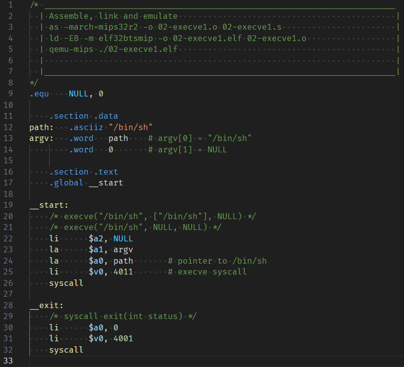

# VSCodium MIPS32 (o32) Assembly Syntaxer

**MIPS Assembly Syntaxer** is a **VSCodium Extension** which provides
GNU sytle syntax coloring. Also works in _vscode_. Specifically, this
extension highlights MIPS32 (o32) architecture.

## Screenshots

## Todo

* Finish development
* Starter snippets
* Add debugger support for linux (remote)
* Add compiler support

## Author

Blue DeviL // SCT

## Last Words

> Assembly of shadows
>
> ---
>
> Symbolic silence within coded shadows  
> interlocked pipelines bleed slow  
> whispers gently, the machine...  
>
> Blue DeviL // SCT  
> 21.04.2025

## License

AGPLv3
